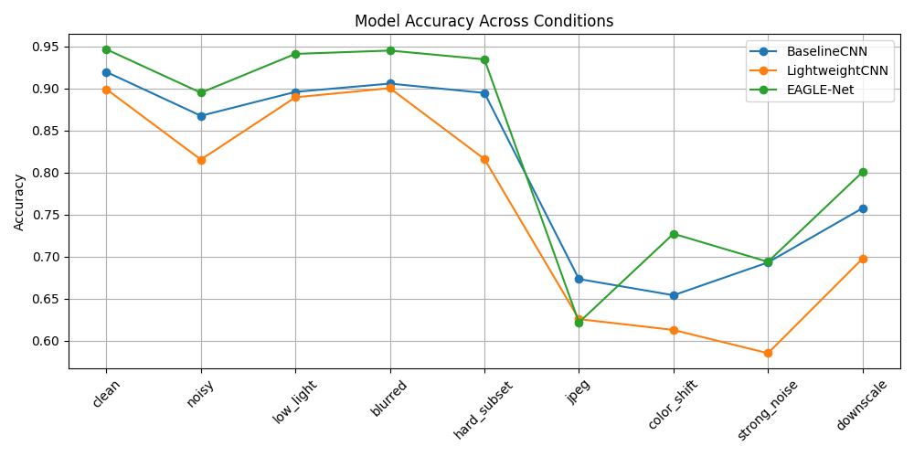
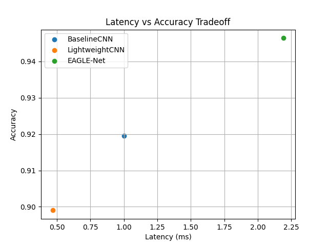

# EAGLE-Net: Robust Satellite Image Classification

**Understanding how CNN architectures behave under real-world visual distortions.**

EAGLE-Net is a PyTorch-based project that studies how different convolutional neural network architectures perform under realistic image degradations such as noise, blur, compression, lighting variation, and resolution loss.

Instead of optimizing for a single benchmark score, this project focuses on **robustness, failure modes, and deployment-aware tradeoffs** across multiple model designs.

---

## Project Overview

Satellite image classification models are typically evaluated on clean benchmark datasets. However, real-world imagery often contains noise, compression artifacts, lighting shifts, and resolution degradation.

This project investigates how different CNN architectures behave under such conditions by training and evaluating multiple models under a shared experimental framework.

The primary model, **EAGLE-Net**, is designed to improve robustness using multiscale feature extraction, attention mechanisms, and anti-aliased downsampling. Its performance is compared against:

- A standard **BaselineCNN**
- A latency-optimized **LightweightCNN**

---

## Why This Matters

Most machine learning models are evaluated under ideal conditions, but deployed systems rarely encounter clean inputs.

Understanding how models respond to distribution shifts is critical for:

- Reliable real-world deployment
- Failure-mode analysis
- Architecture design decisions

This project emphasizes **how models behave**, not just how they score.

---

## Key Features

- Robustness-aware training pipeline for satellite imagery
- Three model families with distinct design tradeoffs
- Evaluation across clean and distribution-shifted conditions
- JSON-based result storage for reproducibility
- Comparison plots for accuracy, F1 score, and latency
- Presentation-ready analysis notebook
- Interactive FastAPI + Next.js demo for upload-based inference
- Side-by-side model comparison under selected distortion conditions

---

## Model Architectures

### BaselineCNN

A conventional convolutional neural network using stacked convolution, batch normalization, ReLU, and max-pooling layers.

Serves as a strong reference model for standard evaluation.

---

### LightweightCNN

A compact CNN using depthwise separable convolutions.

Optimized for:

- Lower latency
- Reduced parameter count

Provides a deployment-focused comparison point.

---

### EAGLE-Net

A custom robustness-focused architecture incorporating:

- **Dual-kernel inverted residual blocks** for multiscale spatial features
- **Squeeze-and-excitation attention** for channel recalibration
- **Spatial gating** to emphasize informative regions
- **BlurPool downsampling** to reduce aliasing effects

---

## Experimental Setup

- **Dataset:** EuroSAT
- **Task:** Multiclass satellite image classification
- **Input Size:** 64 x 64 RGB images
- **Framework:** PyTorch

Models are evaluated across the following conditions:

- `clean`
- `noisy`
- `low_light`
- `blurred`
- `hard_subset`
- `jpeg`
- `color_shift`
- `strong_noise`
- `downscale`

Results are stored as JSON files in:

```text
artifacts/results/
```

---

## Results Summary

- **EAGLE-Net performs best under most distortions**, indicating that multiscale features, attention, and anti-aliased downsampling improve robustness across several conditions.
- **BaselineCNN performs better under JPEG compression**, showing that robustness is not universal and depends on the distortion type.
- **LightweightCNN achieves the lowest latency**, but sacrifices accuracy under several conditions.
- **Robustness varies across corruption types**, meaning strong performance under one distortion does not guarantee performance under others.

> **Key Insight:** Robustness is distribution-dependent - different architectures specialize in different types of visual distortions.

**Note:** Hard subset metrics are computed on a filtered set of classes and are not directly comparable to full-dataset metrics.

---

## Plots

### Accuracy Across Conditions



### F1 Score Across Conditions


### Latency vs Accuracy Tradeoff



---

## Key Insights

The central takeaway is that **no single architecture is universally robust**.

- EAGLE-Net provides the strongest overall robustness profile
- BaselineCNN remains competitive under compression artifacts
- LightweightCNN highlights efficiency vs accuracy tradeoffs

This makes the project valuable not only for model comparison, but also for understanding **how architectural bias influences robustness behavior**.

---

## Folder Structure

```text
EAGLE-Net/
|-- app/
|   |-- backend/
|   |   |-- core/
|   |   |-- routes/
|   |   `-- main.py
|   `-- frontend/
|       |-- app/
|       |-- public/
|       `-- package.json
|-- artifacts/
|   |-- models/
|   |-- plots/
|   `-- results/
|-- notebooks/
|   |-- eagle_net_analysis.ipynb
|   `-- plot_results.py
|-- src/
|   |-- data/
|   |-- models/
|   |-- training/
|   `-- utils/
|-- requirements.txt
|-- README.md
`-- LICENSE
```

---

## How to Run

### Create virtual environment

```bash
python -m venv .venv
```

### Install dependencies

```bash
pip install -r requirements.txt
```

### Train model

```bash
python -m src.training.train_model
```

### Evaluate model

```bash
python -m src.training.evaluate_model
```

### Generate plots

```bash
python notebooks/plot_results.py
```

### Open notebook

```bash
jupyter notebook notebooks/eagle_net_analysis.ipynb
```

To switch models, update:

```python
CONFIG["model"]["name"]
```

Options:

- `baseline_cnn`
- `lightweight_cnn`
- `eagle_net`

---

## Interactive Demo App

The project includes an interactive demo layer for running local model inference from a browser.

The demo allows users to:

- Upload a satellite image
- Select a distortion condition
- Run inference through the backend
- Compare predictions, confidence scores, and latency across the available models

The app is intended as a portfolio-ready interface for exploring the same robustness questions studied in the research workflow. It does not replace the experimental evaluation pipeline or change the reported benchmark results.

Supported demo conditions:

- `clean`
- `noise`
- `blur`
- `low_light`
- `jpeg`

Model checkpoint files are not committed to the repository. For inference to work, trained checkpoint files must exist locally under:

```text
artifacts/models/
```

Expected checkpoint names:

```text
artifacts/models/baseline_cnn.pth
artifacts/models/lightweight_cnn.pth
artifacts/models/eagle_net.pth
```

---

## App Architecture

The app is split into a FastAPI backend and a Next.js frontend:

- **Backend:** FastAPI service in `app/backend/`
- **Frontend:** Next.js + Tailwind interface in `app/frontend/`
- **Models:** PyTorch architectures from `src/models/architectures.py`
- **Inference:** Model loading and prediction utilities in `app/backend/core/`
- **Artifacts:** Local model checkpoints loaded from `artifacts/models/`

High-level request flow:

```text
User uploads image in browser
        |
        v
Next.js frontend sends image + selected condition
        |
        v
FastAPI backend validates and preprocesses the image
        |
        v
Backend applies the selected distortion condition
        |
        v
Backend runs inference with one or more trained models
        |
        v
Frontend displays predictions, confidence, and latency
```

---

## Backend API

Base local URL:

```text
http://localhost:8000
```

### Health Check

```http
GET /health
```

Example response:

```json
{
  "status": "ok"
}
```

### Single Model Prediction

```http
POST /predict
```

Accepts an uploaded image and runs inference for a selected model.

Parameters:

- `file`: uploaded image
- `model_name`: one of `baseline_cnn`, `lightweight_cnn`, `eagle_net`
- `condition`: one of `clean`, `noise`, `blur`, `low_light`, `jpeg`

### Model Comparison

```http
POST /compare
```

Runs the uploaded image through all available demo models under the selected condition.

FormData:

- `file`: uploaded image
- `condition`: one of `clean`, `noise`, `blur`, `low_light`, `jpeg`

Example request:

```bash
curl -X POST "http://localhost:8000/compare" \
  -F "file=@sample_satellite_image.jpg" \
  -F "condition=noise"
```

Example response:

```json
{
  "condition": "noise",
  "results": [
    {
      "model": "baseline_cnn",
      "prediction": "Forest",
      "confidence": 0.82,
      "latency_ms": 1.0
    }
  ]
}
```

---

## Running the Full App Locally

### 1. Prepare model checkpoints

Train or place the required model checkpoints in:

```text
artifacts/models/
```

The backend loads all demo models at startup. If any expected checkpoint is missing, the API will fail to start inference correctly.

### 2. Install Python dependencies

```bash
python -m venv .venv
```

Activate the environment, then install the project dependencies:

```bash
pip install -r requirements.txt
```

If the FastAPI app dependencies are not already installed in your environment, install them as well:

```bash
pip install fastapi uvicorn python-multipart
```

### 3. Start the backend

From the project root:

```bash
uvicorn app.backend.main:app --reload --host 0.0.0.0 --port 8000
```

Verify the backend:

```text
http://localhost:8000/health
```

### 4. Install frontend dependencies

In a second terminal:

```bash
cd app/frontend
npm install
```

### 5. Start the frontend

```bash
npm run dev
```

Open:

```text
http://localhost:3000
```

The frontend expects the backend to be available at:

```text
http://localhost:8000
```

---

## Running with Docker

The full-stack demo can also be run with Docker Compose.

### 1. Ensure model checkpoints exist locally

The backend expects trained model checkpoints at:

```text
artifacts/models/
```

---

## Running with Docker

The full-stack demo can also be run with Docker Compose.

### 1. Ensure model checkpoints exist locally

The backend expects trained model checkpoints at:

```text
artifacts/models/
````

Expected files:

```text
baseline_cnn.pth
lightweight_cnn.pth
eagle_net.pth
```

These files are not committed to GitHub and must be generated or placed locally before running the Docker app.

### 2. Build the containers

```bash
docker compose build
```

### 3. Start the app

```bash
docker compose up
```

### 4. Open the app

Frontend:

```text
http://localhost:3000
```

Backend health check:

```text
http://localhost:8000/health
```

To stop the app:

```bash
docker compose down
```

---

## Security Notes

The demo includes basic upload validation intended for local development and portfolio demonstration:

- Accepted image types are JPEG, PNG, and WEBP.
- Uploaded files are limited to 5 MB.
- Uploaded files are decoded with Pillow and converted to RGB before inference.
- CORS is configured for local frontend access from `http://localhost:3000`.

Before exposing this app publicly, recommended hardening includes:

- Move CORS origins to environment-specific configuration.
- Add authentication or rate limiting for public deployments.
- Store uploaded files only when necessary, and prefer temporary processing.
- Add request logging and structured error handling.
- Run inference behind a production server configuration.
- Validate model availability during deployment startup.

---

## Screenshots / Demo Preview

Screenshots or a short demo GIF can be added here after the local app UI is finalized.

Suggested preview assets:

- Upload screen
- Distortion condition selector
- Model comparison results
- Latency and confidence display

```text
TODO: Add demo screenshot or GIF.
```

---

## Deployment Roadmap

Planned deployment improvements:

- Package the FastAPI backend with a production ASGI server.
- Add environment-based configuration for API URLs and CORS origins.
- Add a reproducible checkpoint download or artifact restore step.
- Containerize backend and frontend services.
- Add frontend production build verification.
- Add API tests for `/health`, `/predict`, and `/compare`.
- Add lightweight monitoring for inference latency and backend errors.
- Document cloud deployment options once model hosting constraints are finalized.

---

## Limitations

- Evaluation is based on synthetic corruption-based testing rather than cross-dataset validation.
- Some distribution-shifted corruptions are related to training-time augmentations.
- Hard subset metrics are not directly comparable to full-dataset metrics.
- Model calibration under distribution shift is not evaluated.

---

## Future Work

- Cross-dataset generalization testing
- Model calibration analysis
- More realistic sensor-level corruptions
- Class-level robustness breakdowns
- Model compression for EAGLE-Net

---

## Author

Created by [FuriousFire](https://github.com/FuriousFire05)

---

## License

This project is licensed under the MIT License.
